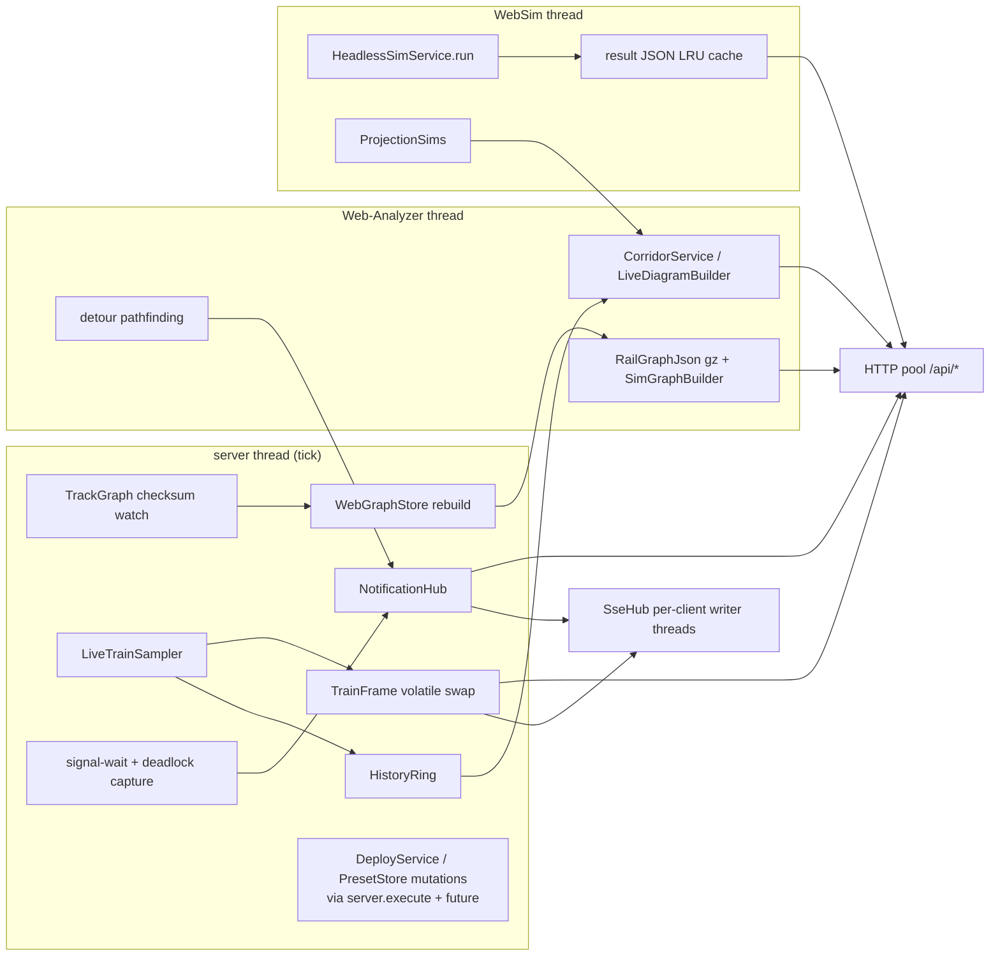

# Advanced Schedule Part 2 — Web Interface

## Context

Part 1 (SPEC.md M1–M5) built the Advanced Schedule feature: deterministic graph translation (`content/graph/v2/`), an MC-free deterministic simulator with conflict detection and root-cause analysis (`content/simulator/`), and in-game presentation. Only M6 (polish) remains — CLAUDE.md's "M4 is next" is stale (fix when present locally; CLAUDE.md is untracked); SPEC.md §7 is authoritative.

Part 2 is a **web interface** served by an HTTP server embedded in the Minecraft server JVM:

1. **Live view** — 2D map of all rail networks with live trains; time-distance diagrams between any two user-selected stations showing *actual observed movements overlaid with the simulated plan*; a notifications panel for live issues (deadlocks, extreme signal waits, extreme detours).
2. **Timetable planner** — the map without trains; a library of named schedule *presets* (imported from live trains or uploaded from in-game advanced-schedule items); the current train roster; drag-and-drop virtual assignment of presets to trains; deterministic simulation of the virtual timetable with map playback, corridor diagrams, conflict/root-cause lists; condition tweaks (delay values, time-of-day, sim start time) from the browser; a **Deploy** button applying assignments to real trains.

Access gated by Discord OAuth + user-ID allowlist → tiers. The feature will later split into a **separate mod** — code is structured now for a clean split; migration itself is out of scope. Target scale (field-tested): ~80k micro-node graph, ~44k edges, ~1k trains.

## Decisions record (interview 2026-08-03)

| Topic | Decision |
|---|---|
| Hosting | **Embedded HTTP server in MC server JVM**; HTTPS via optional reverse proxy (documented) |
| Auth | Discord OAuth2 `identify` only; **user-ID allowlist** → tiers `NONE < VIEWER < PLANNER < DEPLOYER` |
| Live corridor diagrams | **Plan-vs-actual overlay** (observed history + simulated projection) |
| Deploy | Per-deploy mode choice: **IMMEDIATE** swap vs **IDLE_ONLY**; per-train result list |
| Preset ↔ item | In-game advanced-schedule items can **download** presets from and **upload** to the library |
| Frontend | **Vite + Svelte 5**, zero UI/chart libs, hand-rolled canvas; **`web/dist/` committed** — Gradle/CI stay Node-free |
| Audience | Public release eventually — config validation, safe defaults, setup docs |
| Web editing | **Condition value tweaks only** (delay, time-of-day, cyclic, rename); structure stays in-game |
| Alerts | Web panel only (no Discord webhook this phase) |
| Mod split | `net.Realism.web` bounded package + core seam; core→web = 2 bootstrap lines to delete at split time |

## Architecture overview

```
web/                          NEW: Vite+Svelte frontend; committed dist/ → jar assets/realism/web/
common/src/main/java/net/Realism/
  content/graph/v2/RailGraphJson.java        NEW (core): RailGraph → gzipped JSON incl. shape polylines
  content/simulator/HeadlessSimService.java  NEW (core): player-free sim entry (prepare on server thread, run anywhere)
  content/simulator/core/SimDiagram.java     MODIFIED (core): corridor decoupled from phantom (fromPath/populateLines)
  content/trains/schedule/presets/           NEW (core): PresetStore, Preset, PresetJson
  foundation/network/Preset*.java            NEW (core): 3 C2S + 1 S2C packets (append; VERSION "8"→"9")
  foundation/commands/RealismCommands.java   MODIFIED: /dispatcher web subtree (stub is empty; already wired on both loaders)
  web/                                       NEW (moves out at split): WebBootstrap, WebServer, auth/, graph/,
                                             live/, monitor/, sim/, diagram/, api/, sse/, deploy/
```

**The split seam** (verified): core references web in exactly two lines — `WebBootstrap.init()` in `RealismMod.commonSetup()` (registers Architectury `LifecycleEvent.SERVER_STARTED/STOPPING` + `TickEvent.SERVER_POST`; `dev.architectury:architectury:9.2.14` is already a `modImplementation` in `common/build.gradle`, its event API currently unused in `RealismMod`) and `WebCommands.register(...)` inside `RealismCommands.register` (currently an empty stub, already called from `RealismModForge` + `RealismFabric`). Web→core uses only public core APIs (translator, SimTopology, SimGraphBuilder, NetworkSnapshotter, ScheduleCompiler, HeadlessSimService, core engine, SimDebugExporter, PresetStore, CrnCompat, RealismConfig). `net.Realism.web` never touches client classes or MC packets — dedicated-server-safe by construction (the verify skill's load-bearing check).

**Zero new runtime dependencies**: JDK `com.sun.net.httpserver.HttpServer` (jdk.httpserver resolves under Forge/Fabric module layers — prometheus-exporter mods prove it), SSE for live push (no WebSocket), MC-bundled GSON 2.10, JDK `HttpClient` for Discord token exchange. Fallback if ever needed: shading precedent exists (jlayer/shadowJar).

### Backend data flow across threads



## Backend design

### HTTP server & threading

- `WebServer` starts on `SERVER_STARTED` when `WebEnabled` (default **false**), binds `WebBindAddress` (default **127.0.0.1** — exposure is a conscious choice) : `WebPort` (default 8455). Fixed HTTP pool "Realism-Web-N" (4 threads). Static frontend from jar `assets/realism/web/` (`/` → index.html no-cache; `/assets/*` immutable — Vite content-hashes them). Gzip for graph/sim-result/static responses.
- **SSE gets dedicated per-client writer threads** (never the request pool): `SseHub` with per-client `ArrayBlockingQueue(256)`, drop-oldest on backpressure, disconnect on 30 s stall, cap `WebMaxSseClients` (20). Every event flushed; headers `Cache-Control: no-cache`, `X-Accel-Buffering: no`; comment heartbeat ≤ 15 s (reverse-proxy survival).
- Threading map (enforced rule: only LiveTrainSampler, tick-side analyzers, WebGraphStore.rebuild, DeployService, PresetStore train-import, and HeadlessSimService.prepare may touch `Create.RAILWAYS`/`Level` — all server thread):
  - server thread: graph translate, live sampling, signal-wait + deadlock capture, deploy/preset mutations (marshalled via `server.execute` + future, 10 s timeout — same pattern as the result-delivery marshalling at `SimulationService.java:282`)
  - "Realism-Web-Analyzer" (1): graph JSON+gzip+SimGraphBuilder per new entry, detour pathfinding, corridor building, live-diagram projection
  - "Realism-WebSim" (1): headless engine runs, result JSON → LRU byte-cache (`WebSimCacheMB` 128) — **separate from `SimulationService`'s worker** so web sims and in-game item sims can't starve each other
  - "Realism-Web-IO" (1): preset/audit disk writes (atomic tmp+move)

### Graph store

`WebGraphStore` — do **not** reuse `RailGraphCache` (verified `MAX_AGE_MS = 10_000` — would re-translate 80k nodes on a poll cadence). Per TrackGraph: immutable `Entry{RailGraph, SimTopology, SimGraph, gzJson, version (monotonic int), checksum, builtAt}`. Rebuild (server thread, scheduled from tick handler) only when `TrackGraph.getChecksum()` changed OR age > `WebGraphMaxAgeSeconds` (300 — catches station/signal edits the checksum misses), floored by `WebGraphMinRebuildSeconds` (60), forced by `/dispatcher web refresh`. Web node cap `WebGraphNodeCap` default 100000 (existing `GraphNodeCap` default 4000 refuses field-scale nets). JSON: nodes `[x,y,z,dim,type]`, edges with stations{uuid,name,offset,approachable}/crossings/signs/capProfile/**shape polylines**, coords quantized to 0.1-block ints (halves payload; ~0.6–1 MB gz at 100k points). **Edge/node ids are per-version transients** — every id-bearing payload carries `graphVersion`; history rings clear on rebuild; corridors 409 `graph_changed` on mismatch.

### Live pipeline

- `LiveTrainSampler` on `TickEvent.SERVER_POST` every `WebLiveSampleTicks` (20): per train leading `TravellingPoint` → `SimTopology.locate(node1.getNetId(), node2.getNetId(), position)` (verified signature at `SimTopology.java:82`) → immutable `TrainFrame` (volatile swap) + roster metadata. ~1–2 ms at 1k trains.
- `HistoryRing` per train at sparser `WebHistorySampleSeconds` (5) × `WebHistoryHours` (2): packed int/float arrays ≈ 23 MB at 1k trains. Single-writer (server thread), readers copy under per-ring lock.

### Live analyzers → NotificationHub (raise/update/resolve, active map + resolved ring 256)

- **SIGNAL_WAIT** (server thread, free): Create already maintains `Navigation.ticksWaitingForSignal` (incremented while held, reset on green — verified in 6.0.8 sources). WARN past `WebSignalWaitAlertSeconds` (120), CRITICAL at 4×, resolve on drop.
- **DEADLOCK** (server thread, every 5 s): wait-for digraph from `navigation.waitingForSignal` (`Pair<boundaryId, side>`) → `SignalBoundary.groups.get(side)` → groupId; blockers = occupants of that `SignalEdgeGroup` **plus** every group in `intersectingResolved` (diamond crossings — mirrors `isOccupiedUnless`), plus trains whose `reservedSignalBlocks` contain it. Tarjan SCC; SCC ≥ 2 with stable membership for `WebDeadlockConfirmSeconds` (30) → CRITICAL; resolve on membership break.
- **DETOUR** (capture server thread, compute on analyzer thread ≤ 1/train/30 s, ≤ 50 searches/cycle): `navigation.distanceToDestination` vs `SimPathfinder` shortest (`Penalties.NONE`) from head to `navigation.destination.id`; WARN when actual > `WebDetourMinBlocks` (500) and ratio > `WebDetourRatio` (1.75).

### Headless sim (core: `HeadlessSimService`)

```java
record Request(UUID graphId, Map<UUID,CompoundTag> scheduleOverrides, Set<UUID> excludeTrains,
               Long startDayTime, int horizonHours, int headwaySeconds) {}
static Prepared prepare(ServerLevel, TrackGraph, SimTopology, SimGraph, Request)  // SERVER THREAD
static SimResult run(Prepared, int sampleStride, long maxWallMillis)              // any thread
```

`prepare` = `NetworkSnapshotter.snapshot(level, graph, topology)` (verified signature) then per override: `ScheduleCompiler.compile(Schedule.fromTag(tag))`; if clean, replace the spec keeping physicals (length/accel/topSpeed/turnSpeed/head pos/canReverse/initialSpeed), `program=compiled`, `startEntry=0`, fresh progress — this also upgrades obstacle specs (idle/paused trains) into scheduled ones, which *is* the "assign preset to idle train" case. Uncompilable/unmappable → `overrideIssues`. Web default `maxWallMillis=0` (**deterministic**; `WebSimWallCapSeconds` 0=off safety marks `truncated` when used). `ProjectionSims` caches a no-override run per graph for the live plan overlay (`WebProjectionStaleSeconds` 300). Result JSON via existing `SimDebugExporter.buildJson` + additive keys (`rootCauses`, `meta.graphVersion`).

### Corridors (`SimDiagram` refactor — MC-free, tested in `:common:test`)

`buildCorridor(List<Integer> path)` already takes a bare path; the phantom coupling is only in the `build(...)` factory. Add `fromPath(graph, path, stationGroups, hiddenStations)` factory + extract `populateLines(result, specs, leadTrain, caps…)` (leadTrain −1 = rank by coverage, for planner overlays); expose `stationPositions`; make `segment/simplify/capPoints` public static. Corridor path: resolve station groups A,B via `StationIndex` (CRN tags else platform-number stripping, reusing `CrnCompat`), try ≤ 4 A-platforms with `SimPathfinder` (`Penalties.NONE` — geography, not traffic), keep shortest; twin-mirroring already projects opposing traffic. `LiveDiagramBuilder` projects history rings through `project(edge,offset)` with the same segment/simplify semantics.

### Presets (core) & item packets

- `PresetStore`: `<world>/realism/presets/<uuid>.json` — JSON envelope {id, name, source, timestamps, schedule as **SNBT**}; validation = the `AdvancedScheduleSavePacket` template (verified: `MAX_TAG_BYTES = 262144` NbtAccounter, `Schedule.fromTag` → `write()` round-trip); server-thread mutations, IO-thread persistence; cap `WebPresetMaxCount` (500).
- Web value edits: **whitelist-by-construction** (only these keys on existing conditions): `create:delay`{Value,TimeUnit}, `create:time_of_day`{Hour,Minute,Rotation}, `realism:time_of_day_realistic`{Hour,Minute}, `createrailwaysnavigator:dynamic_delay`{Value,TimeUnit,Min}, `…:train_separation`{Ticks}, `create:throttle`{Value} — matches `ScheduleCompiler` exactly. Everything else read-only; structural edit attempts → 400.
- Packets (append at END of `RNetworking.register()`, **VERSION "8"→"9"** at `RNetworking.java:25`): `PresetListRequestPacket` C2S → `PresetListPacket` S2C (cap 200); `PresetUploadPacket{name}` C2S (held item → store); `PresetDownloadPacket{uuid}` C2S (store → held item's "Schedule" sub-tag). Screen buttons on `AdvancedScheduleScreen` via a client-only holder (the `SimulationResultOpener` pattern — packet classes never reference Screens; dedicated-server rule).

### Deploy (server thread; deployer tier; audited)

Per train, in order: materialize preset tag + whitelisted overrides → **strip `"Progress"`** (else `setSchedule` clamps `currentEntry` to saved progress) → compile-clean check → IDLE_ONLY predicate (`!derailed && speed≈0 && navigation.destination==null && (no schedule || paused || completed || at station)`) → **`runtime.discardSchedule()` first** (`setSchedule` alone does NOT cancel navigation — verified) → guard non-empty → `runtime.setSchedule(s, false)` → **then** `((IScheduleRuntimeMixin)runtime).setAdvancedSchedule(true)` (verified: `ScheduleRuntimeMixin` resets the flag at `setSchedule` TAIL (`mixin/ScheduleRuntimeMixin.java:84–88`), interface `Interfaces/IScheduleRuntimeMixin.java` — order matters) → audit line to `<world>/realism/web-audit.jsonl`. Response: per-train `{ok, reason?: not_found|derailed|not_idle|preset_invalid|empty}`.

### Auth & config

- OAuth2 code flow, `identify` only; redirect built from `WebPublicUrl`; state HMAC-bound; session = HMAC-SHA256 cookie (HttpOnly, SameSite=Lax, Secure iff publicUrl is https, `WebSessionHours` 72). CSRF: mutations require header `X-Realism-Csrf` + Origin check when present — **the SSE GET is exempt** (EventSource can't send custom headers). Rate limits on `/auth/*` and expensive endpoints. API 401s are JSON, never redirects.
- **Secrets never in ForgeConfigSpec** (COMMON ships in client installs; SERVER type syncs to clients). Server-only `config/realism-web/secrets.json` {discordClientId/Secret, auto-generated sessionSecret} + `allowlist.json` {discordId → {tier, note}}, hot-reloaded on mtime (30 s) and via command.
- `RealismConfig` COMMON new "Web Interface" push-block after "Advanced Schedule", existing style (CamelCase fields, spaced display keys, comment+defineInRange): WebEnabled, WebBindAddress, WebPort, WebPublicUrl, WebHttpThreads, WebMaxSseClients, WebLiveSampleTicks, WebHistorySampleSeconds, WebHistoryHours, WebGraphNodeCap, WebGraphMinRebuildSeconds, WebGraphMaxAgeSeconds, WebSignalWaitAlertSeconds, WebDeadlockConfirmSeconds, WebDetourRatio, WebDetourMinBlocks, WebSimMaxHorizonHours, WebSimMaxQueued, WebSimCooldownSeconds, WebSimWallCapSeconds, WebSimCacheMB, WebProjectionStaleSeconds, WebSessionHours, WebPresetMaxCount.
- Commands in the empty `RealismCommands` stub (op 3): `/dispatcher web status|reload|refresh [graph]|allow <id> <tier>|deny <id>|list|session <tier>` — `session` mints a one-time signed login URL (5 min): the dev/test path needing no Discord app, and the escape hatch for Discord-less servers.

## Wire protocol (reconciled backend↔frontend)

REST (all `/api/*` need a session; errors `{error, detail|fields}`):

| Method/Path | Tier | Notes |
|---|---|---|
| GET `/auth/login?return=` → Discord; GET `/auth/callback`; POST `/auth/logout`; GET `/auth/token/{oneTime}` | public | cookie set on success |
| GET `/api/me` | any | `{discordId, username, avatar, tier}` |
| GET `/api/status` | viewer | server info, limits, graph ages |
| GET `/api/graphs` | viewer | index: id, version, dims, per-dim bbox, counts |
| GET `/api/graphs/{id}` | viewer | full JSON, gzip, `ETag = version`, 304 support |
| GET `/api/stations?graph=` | viewer | logical groups → platforms (uuid, name, edge/offset, x,z,dim) |
| GET `/api/trains` | viewer | rosterVersion + per-train identity/traits/state/schedule summary |
| GET `/api/live/positions` | viewer | latest frame (snapshot fallback for the SSE stream) |
| GET `/api/events` | viewer | **the single SSE stream** (below) |
| GET `/api/notifications` | viewer | active + recently resolved snapshot |
| GET `/api/corridor/actual?graph&from&to&sinceTick` | viewer | corridor meta + actual lines (incremental via sinceTick; ETag) |
| GET `/api/corridor/plan?graph&from&to` | viewer | projection overlay; 202 `{pending}` while computing; `stale`/age flags |
| POST `/api/sims` | planner | `{graphId, assignments:[{trainId, presetId, valueOverrides[]}], removals, keeps, removeScheduled (default true — clears the live timetable), startDayTime?, horizonHours, headwaySeconds?}` → 202 `{simId}`; 429 on cooldown/queue |
| GET/POST/DELETE `/api/plans…` | planner | saved planned timetables (assignments + keeps/removals + sim settings); POST with `id` overwrites, without creates |
| GET `/api/sims/{id}` / DELETE | planner | status / cancel |
| GET `/api/sims/{id}/result` | planner | gzipped SimDebugExporter-shaped JSON (+ rootCauses, meta.graphVersion) |
| GET `/api/sims/{id}/diagram?graph&from&to` | planner | sim samples projected on a corridor |
| GET/POST/PATCH/DELETE `/api/presets…` | planner | list/detail (structured, no raw NBT out), create-from-train, value-edit PATCH (400 on non-whitelisted key), delete |
| POST `/api/deploy` | deployer | `{assignments (same shape as sims), mode: IMMEDIATE\|IDLE_ONLY}` → per-train results |
| GET `/api/audit?limit=` | deployer | recent JSONL entries |

SSE `/api/events` — cookie auth only; monotonic `id:` for `Last-Event-ID`; bounded replay buffer, `reset` event when uncoverable; `retry: 3000`:

| event | payload | cadence |
|---|---|---|
| `hello` | serverTick, **serverWallMs**, dayTime, dayTimeRate, graphs{id:version}, rosterVersion, tier | connect |
| `trains` | tick, serverWallMs, `g:{graphId:version}`, compact `[[trainUuid, graphId, edgeId, offset, speed]…]` moved-only (full every 10th) | ~1 s |
| `trainMeta` | `{rosterVersion}` → client refetches `/api/trains` | on change |
| `graph` / `graphIndex` | `{id, version}` / network add-remove | on rebuild |
| `notify` | full notification `{id, kind, severity, state, trains, x,z,dim, since, data}` | raise/update/resolve |
| `sim` | `{simId, state, progressTicks, queuePos?}` | state change + 2 s while running |
| `deployed` | who/what summary | on deploy |
| `reset` | `{}` → refetch all snapshots | rare |

Assignments live client-side (browser store); sim and deploy requests carry the full assignment list — no server session state.

## Frontend design (web/)

- **Svelte 5** (runes; no SvelteKit — plain Vite, one index.html, ~40-line hash router so the JDK server needs no rewrite rules; deep links like `#/live?g=…&a=…&b=…` free). npm, 5 dev-deps (`svelte`, `@sveltejs/vite-plugin-svelte`, `vite`, `typescript`, `svelte-check`), Node ≥ 20.19 documented. `VITE_MOCK=1` fixture mode (captured SimDebugExporter JSON + synthetic graph) lets frontend milestones demo before their backend lands.
- **State rule**: runes for UI truth; **plain mutables for the 60 fps hot path** (positions, playback t, camera) read directly by the rAF loop. Only stable UUIDs cross the graph boundary — node/edge ids stay inside the per-version `LoadedGraph`.
- **Map renderer** (shared live/planner/playback): two stacked canvases. *Static layer* = offscreen raster (track/nodes/stations, 2× viewport margin) re-rasterized only on zoom-settle/pan-escape/dim/LOD/version change (~3–8 ms with culling+LOD); blitted per frame (~0.3 ms) — a naive 100k-point per-frame stroke would cost 10–30 ms, hence the bitmap. *Dynamic layer* = trains, labels, badges, selection (1–2 ms). Web Worker converts graph JSON → transferable typed arrays (`Float32Array` points, per-edge arc tables, CSR adjacency, uniform 256-block grid, Douglas-Peucker LOD tiers ε 0.75/3.0/chords); first paint = synchronous chords, LOD upgrades in place. `(edgeId, offset) → xy` via arc tables = `GraphMapScreen.pointAlong` semantics (fixes sim_debug's straight-chord gap). Camera = port of `GraphMapScreen` zoom-anchor math. Trains: keep last two SSE samples, render at estimated server tick − 1.5 s, cross-edge interpolation via ≤ 4-hop adjacency walk (sim_debug `trainPos` port), snap > 200 blocks. Labels: UUID-dedupe, scale ≥ 1.0 gate (in-game rule), greedy screen-space grid + hysteresis. Playback: port sim_debug's hold-point insertion + per-sample path cursors verbatim, upgraded to arc-table positions.
- **Diagram component**: exact ports of `SimTimeFormat` (hour = (dayTime/1000+6)%24, D+n rollover, frozen-clock "+m:ss") and `TimeDistanceDiagramWindow` (grid ladder 5m→24h @ ≥ 70 px, time-only pan/zoom, station gridlines + gutter labels, data-space clipping, hover: conflict-within-6px beats line-within-5px). **Actual = solid 2.25 px; plan = dashed 1.25 px @ 55%**, same hue per train (color-blind-safe redundancy); "now" line from the clock store; live mode polls `/api/corridor/actual?sinceTick=` every 10 s (dirty-flag rendering, no rAF).
- **Planner UX**: presets (280 px) | map | trains (320 px) + bottom sim/transport dock; conflict panel slides over trains in playback. **Custom pointer-based DnD** (HTML5 DnD is unstylable + no touch): 6 px slop/150 ms hold, pointer capture, ghost chip, Escape cancels; click-to-assign fallback (arm preset → click train), keyboard operable. Assignment chips: amber draft / blue saved / green deployed + override count. Condition editor drawer: read-only structure, editable controls only for whitelisted keys; optimistic with field-level error mapping. Deploy modal: mode radio ("Immediate — interrupts current trips" / "Safe — only idle trains"), per-train result list.
- **Clock sync**: EMA over `(tick, serverWallMs)` beacons; measured effective TPS (servers sag below 20); drives interpolation delay, now-line, header clock.
- **Design**: dark default, exact in-game palette carried over (bg `#10101C`, panels `#181828`, track `#8A8A96`, station cyan `#55DDEE`, signals `#FF5555`/`#FFA030`, phantom green `#40FF70`, 8-color train palette); mono (`ui-monospace…`) for data, `system-ui` for prose; 4 px grid, flat 1 px borders; keyboard: space/←→/+-/esc/f/g/d/1–6 + `?` overlay.
- **Build integration**: committed `web/dist/` (NOT under src/main/resources); `common/build.gradle`: `processResources { from(rootProject.file("web/dist")) { into "assets/realism/web" } }` — common resources already reach both platform jars (sim_debug.html precedent). `.gitignore`: add `web/node_modules/`, `web/.vite/` (verified: existing global patterns `build/`, `out/`, `libs/`, `bin/` don't catch `web/dist/` — no negation guard needed, but add `!web/dist/` as belt-and-braces against future patterns). **verifyWebDist** honesty check: Vite plugin writes `dist/.buildinfo.json` (SHA-256 over web sources); a pure-Groovy task recomputes and warns on `check` (CI env promotes to fail) — no Node in Gradle. Dev loop: MC dev server + `npm run dev` (Vite proxy to :8455 with `timeout: 0` for SSE); auth via `/dispatcher web session <tier>` URL.

## Milestones (each shippable; backend + frontend land together per milestone)

- **W0 — Foundations.** Author `SPEC-WEB.md` (decisions record + design, this plan condensed; fix CLAUDE.md's stale "M4 next" note). Backend: WebBootstrap/WebServer lifecycle, config block, secrets/allowlist files, OAuth + sessions + tiers + AuthFilter, `/api/me`, `/api/status`, static serving, `/dispatcher web` commands incl. `session`. Frontend: project scaffold, theme, router, session store, **map engine proven on fixtures** (synthetic 100k-point graph + captured sim JSON playback @ 60 fps).
  *Verify:* `./gradlew build`; dev server + `curl -I 127.0.0.1:8455/` 200; no cookie → 401; session-URL → `/api/me` tier; wrong tier → 403; WebEnabled=false → no bind; `VITE_MOCK=1 npm run dev` demo.
- **W1 — Live map.** WebGraphStore + RailGraphJson (+quantization, ETag/versions), LiveTrainSampler, `/api/graphs*`, `/api/trains`, `/api/live/positions`, SseHub + hello/trains/trainMeta/graph/ping. Frontend: real auth flow, graph worker pipeline, live SSE + interpolation, follow mode, dimension filter, hover tooltips.
  *Verify:* trains glide along real curve geometry matching in-game; If-None-Match → 304; delete a train → roster refresh; rebuild duration logged (< target at test scale); `curl -N /api/events` shows heartbeats.
- **W2 — Notifications.** NotificationHub + 3 analyzers + snapshot endpoint + notify events. Frontend: panel, toasts, map badges, focus-to-map.
  *Verify (staged in-game):* blocked signal → SIGNAL_WAIT raises after threshold, resolves on release; head-on single-track → DEADLOCK after 30 s confirm; forced long reroute → DETOUR; tick time unaffected (spark).
- **W3 — Corridors & plan overlay.** SimDiagram refactor (+`:common:test` units: fromPath equals old corridor for phantom path; segment extraction), HistoryRing, StationIndex, CorridorService + actual endpoint, HeadlessSimService + ProjectionSims + plan endpoint. Frontend: corridor picking (station A→B), DiagramCanvas actual-vs-plan + now-line + incremental polling.
  *Verify:* `./gradlew :common:test` green; benchmark digest unchanged (`c066c772a58f7ac4`); pick two stations → actual lines match observed runs, plan overlay appears, station marks ordered; two identical projection runs → byte-identical JSON.
- **W4 — Presets.** PresetStore/Json + 4 packets + **VERSION 9** + AdvancedScheduleScreen buttons (client-only holder) + web preset endpoints. Frontend: preset library, import-from-train, condition value editor.
  *Verify:* upload from item → in web list; PATCH a delay → download to item → in-game editor shows new value; structural edit → 400; old client joins → version-mismatch disconnect (expected).
- **W5 — Planner sims.** `/api/sims` queue/status/result/diagram + sim SSE + LRU cache. Frontend: DnD assignment, sim run flow, playback (map animation + transport), conflict/root-cause panels with focus + diagram tab.
  *Verify:* assign preset to an idle train → sim shows it running; deliberate collision pair → conflicts listed and badged; queue cap → 429; identical requests → identical results.
- **W6 — Deploy & hardening.** DeployService + audit + `/api/deploy`, rate limits, config validation with clear startup log lines, `docs/web-interface.md` (Discord app setup, reverse-proxy TLS + SSE snippet, allowlist), verifyWebDist wired to `check`, light theme + keyboard overlay polish, load pass at field scale (44k-edge dataset), CHANGELOG.
  *Verify:* IDLE_ONLY skips a moving train (`not_idle`), IMMEDIATE swaps mid-run and the train reroutes; conductor `returnSchedule` hands back an Advanced Schedule item (flag ordering); audit lines written; deploy from a second browser fires `deployed` event.

## Verification (overall)

- MC-free logic (SimDiagram refactor, HeadlessSimService pure parts, RailGraphJson if kept MC-light) → JUnit in `:common:test`; benchmark digest must stay `c066c772a58f7ac4` for pure-perf work.
- In-game/server behavior → the `/verify` skill's workflow (`.claude/skills/verify/SKILL.md`): `./gradlew :forge:runClient` (then `:fabric:runClient`), user confirms in-game; dedicated-server checks via runServer + curl (auth, SSE, endpoints; zero realism `NoClassDefFoundError` — packets never reference Screens). Web UI → `npm run dev` against the dev server (session-URL auth) and `VITE_MOCK=1` for pure-frontend iteration.
- Full build: `./gradlew build` (runs `check` incl. verifyWebDist warn).

## Risks

1. **Server-thread translation hitch at 80k nodes** (top risk): mitigated by change-triggered + min-interval rebuilds (never poll-driven), duration logging with >100 ms warning; future option noted in code: tick-budgeted/incremental assembly.
2. **SSE through proxies / slow clients**: heartbeat + no-buffering headers + bounded queues + drop-oldest + client staleness watchdog (>25 s → reconnect).
3. **Sim queue starvation / runaway web sims**: separate worker, `WebSimMaxQueued`, per-session cooldown, horizon cap; determinism default (wall cap 0) with `truncated` honesty when enabled.
4. **Edge-id instability across rebuilds**: version stamps everywhere, history cleared on rebuild, buffered position frames applied only on version match — wrong-edge rendering impossible by construction.
5. **Auth**: allowlist is the real boundary (deployer = full train control); loopback bind default, secrets outside ForgeConfigSpec, HMAC state/session, CSRF header + Origin, rate limits, `Secure` cookie iff https.
6. **Frontend perf cliffs**: raster split across frames if settle-raster >10 ms; zero per-frame allocations; DPR cap on huge viewports; typed-array memory ~2 MB/graph.
7. **Deploy correctness traps** (verified, encoded in W6 tests): discardSchedule-before-setSchedule, advancedSchedule-flag-after-setSchedule (mixin TAIL reset), Progress-strip.

## Critical files

Modify: `common/…/content/simulator/core/SimDiagram.java`, `content/simulator/SimDebugExporter.java`, `config/RealismConfig.java` (new push-block after "Advanced Schedule"), `RNetworking.java` (VERSION at line 25, append registrations), `RealismMod.java` (bootstrap line in `commonSetup()`), `foundation/commands/RealismCommands.java` (empty stub, already loader-wired), `common/build.gradle` (processResources + verifyWebDist), `.gitignore`, `content/trains/schedule/AdvancedScheduleScreen.java` (preset buttons).
Reference (patterns to follow): `content/simulator/SimulationService.java` (threading/marshalling at :282; leave the item path untouched), `NetworkSnapshotter.java` (`snapshot(Level, TrackGraph, SimTopology)`), `foundation/network/AdvancedScheduleSavePacket.java` (262144-byte NbtAccounter + fromTag/write round-trip), `mixin/ScheduleRuntimeMixin.java` + `Interfaces/IScheduleRuntimeMixin.java` (deploy flag ordering), `content/gui/GraphMapScreen.java` + `TimeDistanceDiagramWindow.java` + `SimTimeFormat.java` (semantics ported to web), `assets/realism/sim_debug.html` (playback math), `compat/CrnCompat.java`, `content/graph/v2/RailGraphCache.java` (what NOT to reuse — 10 s TTL), `content/gui/SimulationResultOpener.java` (client-only holder pattern).
New: `content/graph/v2/RailGraphJson.java`, `content/simulator/HeadlessSimService.java`, `content/trains/schedule/presets/*`, `foundation/network/Preset*Packet.java`, the `net.Realism.web.**` tree, `web/` frontend project, `SPEC-WEB.md`, `docs/web-interface.md`.
